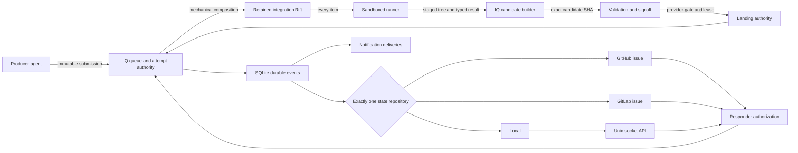

# Integration Agent And Control Plane PRD

## Problem

IQ can serialize immutable submissions, create and retain integration Rifts, validate an exact candidate, and land it safely. Its current merge-conflict prompt can apply only `use source` or `use target` to the complete conflict set. It cannot preserve independent valid changes in the same integration.

IQ also uses `DecisionTransport` as both a projection mechanism and an answer path. It permits transport vectors, has no complete integration-effort state model, and has no supervised local agent, local API, event stream, or notification delivery model.

## Solution

IQ mechanically composes every queue item into a retained integration Rift. A sandboxed local agent then performs or approves semantic integration for every item. The agent stages the integrated tree and returns a typed result; it never commits. One IQ-owned candidate builder creates and records the correct candidate for the source and landing variant, invalidates old evidence, and sends that exact candidate through validation, signoff, provider gates, and leased landing.

SQLite remains the only durable authority. Each project selects exactly one state repository: `local`, `github_issue`, or `gitlab_issue`. A separate local Unix-socket API serves commands and events. Notification backends send bounded, transient alerts from durable events.

OpenCode is the first local runner. The runner boundary permits a future provider without changing queue, effort, candidate, repository, API, or notification contracts.

## Requirements

### Integration Agent And Candidate Authority

- [ ] Every queue item enters one integration effort and reaches `agent_ready` after IQ mechanically composes target and source in the retained integration Rift. This applies to clean and conflicted composition.
- [ ] The agent performs or approves semantic integration. For clean composition, it can return `resolved` without edits after it checks the staged tree and relevant repository authority.
- [ ] IQ gives the agent exact item, attempt, cycle, repository, target, source, source variant, landing variant, retained Rift, conflict, prior-cycle, validation, and repository-instruction identities.
- [ ] The agent can change and stage only the retained integration Rift. It cannot commit, create a candidate, validate candidate identity, authorize signoff, contact a Git remote, land, or mutate IQ state.
- [ ] The agent preserves the specified valid target and source behavior. It removes obsolete duplicate paths when repository authority requires this. A whole-set source or target choice is not an integration result.
- [ ] Exactly one IQ-owned candidate builder runs after every accepted `resolved` result and after every accepted repair result.
- [ ] The candidate builder rejects unresolved index entries, an unstaged worktree, identity changes, forbidden paths, and an empty local submission.
- [ ] Before Git mutation, IQ enters `candidate_building` in one transaction with expected staged-tree digest, parent SHAs, commit metadata, cycle ID, and unique builder operation ID. The builder, not the agent, writes the commit.
- [ ] For a local submission with squash landing, the builder creates one non-empty commit whose only parent is the exact target SHA. For a remote-branch direct or provider landing, it creates the merge-candidate graph required by the existing landing policy.
- [ ] After Git mutation, one SQLite transaction verifies the operation intent and exact commit, records the candidate SHA, changes the effort to `candidate_ready`, and invalidates all earlier validation and signoff evidence. No evidence for another SHA can authorize this candidate.
- [ ] Restart reconciliation in `candidate_building` accepts only a commit whose tree, parents, metadata, and operation identity match the durable intent. It records that candidate or resets to `agent_ready`; any other commit is an infrastructure blocker.
- [ ] IQ remains authority for FIFO, attempts, Rifts, candidate shape, exact SHA identity, validation, signoff, provider gates, target leases, landing reconciliation, and cleanup debt.

### Configuration And Repository Binding

- [ ] System configuration defines the approved runner executable and identity, default agent, default model, cycle timeout, process/resource bounds, protocol size bounds, and log bounds.
- [ ] The failed automatic-cycle threshold is the fixed value 10. It is not configurable.
- [ ] Project `.iq/config.json` can override only the model. It cannot override runner, agent, executable, cycle threshold, timeout, sandbox, resource, protocol, or log bounds.
- [ ] Project policy selects exactly one tagged state-repository variant: `local`, `github_issue`, or `gitlab_issue`. Vectors and multiple simultaneous repositories are invalid. The default is `local`.
- [ ] An issue variant includes one exact provider repository identity, visibility `minimal` or `full`, and a non-empty responder allowlist. `local` has no external repository or visibility field.
- [ ] Before enqueue commits, IQ resolves and verifies the project repository binding and visibility, then snapshots it on the queue item. Thus `full` can reserve and create its issue from the enqueue transition.
- [ ] At effort start, IQ snapshots effective runner executable identity, runner kind, agent, model, timeout, process/resource/protocol/log bounds, and sandbox capability identity. Resume and target movement keep this snapshot.
- [ ] A changed or invalid snapshot, unavailable approved executable, or unavailable sandbox creates an infrastructure blocker before a cycle starts.

Example system configuration:

```yaml
integration_agent:
  runner: opencode
  executable: /usr/local/bin/opencode
  agent: iq-integration
  model: openai/gpt-5.6-sol
  cycle_timeout_seconds: 1800
  max_log_bytes: 1048576
  max_result_bytes: 262144
  max_processes: 64
  memory_bytes: 4294967296
  cpu_seconds: 1800
  writable_bytes: 8589934592
  open_files: 4096
  credential_env: OPENAI_API_KEY

control_plane:
  unix_socket: /home/user/.local/state/iq/control.sock
  max_request_bytes: 262144
  max_free_text_bytes: 16384
  max_response_bytes: 1048576
  max_concurrent_clients: 32
  max_client_queue_bytes: 1048576
  max_stream_backlog_events: 10000
  client_idle_seconds: 60
```

Example project policy:

```json
{
  "version": 2,
  "integration": {
    "validation": {"command": "bun run check && bun run build"},
    "signoff": {"mode": "none"},
    "agent": {"model": "openai/gpt-5.6-sol"}
  },
  "state_repository": {
    "kind": "gitlab_issue",
    "visibility": "minimal",
    "repository": "group/project",
    "allowed_responders": ["kcourbet"]
  }
}
```

### Integration-Effort Aggregate

- [ ] One queue item owns at most one effort. The effort references the current `integration_attempts` row and retained queue-item Rift. It does not replace queue item, attempt, workspace, or landing authority.
- [ ] Queue status is derived from effort state during this refactor. Old queue phase and blocker columns are removed or replaced in schema v9; no second writable state machine remains.
- [ ] Cleanup is not an effort state. Terminal queue cleanup and retained-Rift cleanup stay in the existing cleanup-debt lifecycle.
- [ ] Each effort has immutable item ID and effort ID; current attempt ID; exact target and source SHA; source and landing variants; retained Rift identity; runner snapshot; repository snapshot; failed consumed-cycle count; current state payload; created and updated times.
- [ ] SQL foreign keys, unique indexes, `CHECK` constraints, and triggers require each state's payload, prohibit payloads owned by other states, and reject invalid combinations. At most one running cycle, open guidance request, current candidate, repository artifact, and terminal result can exist per effort.

The aggregate state matrix is authoritative:

| State | Required payload and invariant | Legal next states |
| --- | --- | --- |
| `agent_ready` | Current attempt, exact target/source, retained Rift, runner snapshot, and next cycle number; no live runner or current candidate | `agent_running`, `infrastructure_blocked`, `cancelled` |
| `agent_running` | One started cycle with process/start identity, input digest, atomic result-file state, start time, and authority lease | `candidate_building`, `agent_ready`, `guidance_required`, `infrastructure_blocked`, `cycle_limit_blocked`, `cancelled` |
| `candidate_building` | Durable builder operation ID, accepted cycle, staged-tree digest, exact parents, commit metadata, and no candidate evidence | `candidate_ready`, `agent_ready`, `infrastructure_blocked`, `cancelled` |
| `candidate_ready` | Candidate SHA and builder evidence match target/source/landing variant; old validation and signoff evidence are absent | `validating`, `agent_ready`, `cancelled` |
| `validating` | Validation policy snapshot and exact candidate SHA; any evidence under construction names that SHA | `landing`, `agent_ready`, `guidance_required`, `infrastructure_blocked`, `provider_blocked`, `cancelled` |
| `guidance_required` | Typed semantic `IntegrationBlocker`, one open request, exact attempt/cycle/target/source/candidate identities as applicable | `agent_ready`, `cancelled` |
| `infrastructure_blocked` | Typed infrastructure `IntegrationBlocker`; no live runner | `agent_ready`, `candidate_ready`, `validating`, `landing`, `cancelled` according to recorded resume state |
| `cycle_limit_blocked` | Typed cycle-limit blocker, failed consumed-cycle count exactly 10, durable alert event | `agent_ready` only after authorized explicit retry resets the count, or `cancelled` |
| `provider_blocked` | Typed provider/signoff blocker, exact candidate and external gate identity; no automatic agent retry | `landing`, `agent_ready` only with evidence of candidate defect, or `cancelled` |
| `landing` | Validated candidate, exact signoff disposition `not_required` or matching evidence, expected target SHA, and landing lease identity | `landing_uncertain`, `integrated`, `agent_ready` after target movement, `provider_blocked`, `infrastructure_blocked`, `cancelled` |
| `landing_uncertain` | Candidate SHA, expected target SHA, command identity, and reconciliation evidence | `integrated`, `landing`, `provider_blocked`, `infrastructure_blocked` after reconciliation proves the landing outcome |
| `integrated` | Candidate and landed SHAs, exact terminal attempt, terminal event; no open blocker or live cycle | Terminal |
| `cancelled` | Cancellation actor/reason/time; no live cycle or open request | Terminal |

### Typed Blockers And Projection

`IntegrationBlocker` is an exhaustive tagged type:

| Variant | Required payload | Resume authority |
| --- | --- | --- |
| `semantic_guidance` | Request ID, bounded question, affected contracts/paths, alternatives, evidence, exact identities | Authorized responder |
| `infrastructure` | Component `configuration`, `sandbox`, `runner`, `filesystem`, `database`, or `validation`; operation; typed cause; resume state | IQ operator after repair |
| `cycle_limit` | Count 10, cycle IDs, last typed failure, alert event ID | Authorized explicit retry or cancellation |
| `provider_signoff` | Gate kind, provider/repository/context identity, candidate SHA, pending or failed status, evidence | Provider/signoff reconciliation |

- [ ] Every blocked effort state contains exactly the matching blocker variant. Non-blocked states contain none.
- [ ] `minimal` issue visibility projects every blocker variant. It creates the issue on the transition into a blocked state, updates the same issue for later blockers, and closes it at `integrated` or `cancelled`.
- [ ] `full` issue visibility projects every durable lifecycle transition in the aggregate matrix, including enqueue before the effort starts and terminal closure.
- [ ] `local` projects every durable transition to SQLite events and the local API and never creates an issue.

Transition-to-projection rules are exact:

| Durable transition | `local` | Issue `minimal` | Issue `full` | Notification event |
| --- | --- | --- | --- | --- |
| Enqueued or non-blocking effort transition | Append local event | None | Create/update issue and append lifecycle event | None |
| Enter or change any blocker variant | Append local event | Create/update issue and append blocker event | Update issue and append blocker event | Enqueue one alert |
| Authorized answer or explicit retry | Append local event | Append answer/resume event | Append answer/resume event | None |
| `integrated` or `cancelled` | Append terminal event | Update and close existing issue, if any | Update and close issue | Optional terminal alert only when configured |
| Projection attempt fails | Append projection-debt event | Persist debt and bounded retry | Persist debt and bounded retry | Alert only after configured debt-age threshold |

### Automatic-Cycle Outcomes

A cycle starts only after sandbox admission and runner launch succeed. A consumed cycle increments the failed consumed-cycle count when its classified result does not reach a valid candidate and automatic validation. A cycle that returns `resolved` and then fails validation consumes one failed cycle when IQ classifies the validation as an agent-repairable candidate defect.

| Outcome | Count | Required action |
| --- | --- | --- |
| `resolved`, candidate builds, validation succeeds | No failed count | Continue to gates and landing |
| `resolved`, candidate builds, validation is unsuccessful and evidence identifies an agent-repairable candidate defect | Consume completed cycle | Invalidate candidate evidence, set `agent_ready`, and provide exact validation evidence |
| `guidance_required` | Consume current cycle | Set `guidance_required`; do not retry automatically |
| Agent reports `mechanical_failure` | Consume current cycle | Set `agent_ready` and retry automatically while count is below 10 |
| Result is invalid, missing, too large, identity-mismatched, or inconsistent with the Rift | Consume current cycle | Record invalid output and retry automatically while count is below 10 |
| Runner times out, crashes, or is interrupted after cycle start | Consume current cycle | Terminate it, retain evidence, and retry automatically while count is below 10 |
| System config, sandbox, or runner is unavailable before launch | No cycle starts | Set `infrastructure_blocked` immediately |
| Target moves during an in-flight or stale cycle | Do not count superseded cycle | Terminate runner, mark cycle superseded, rebuild composition on new target, invalidate old evidence, and start a replacement cycle |
| Provider or signoff is pending or fails externally | No agent count | Set `provider_blocked`; retry or reconcile that gate, not the agent |
| Provider/signoff evidence proves a candidate defect | Consume the cycle that produced the candidate if not already consumed | Invalidate evidence and set `agent_ready` |

- [ ] When a failed consumed-cycle count changes to 10, IQ does not start cycle 11. It creates `cycle_limit`, enters `cycle_limit_blocked`, and writes one deduplicated durable alert event in the same transaction.
- [ ] A validation infrastructure failure uses `infrastructure`, not an agent retry. A semantic product or architecture choice uses `semantic_guidance`, not an agent retry.

### OpenCode Runner Sandbox And Restart

ADR 0006 defines IQ as solo local tooling. The runner boundary provides basic process isolation and resource bounds, not security hardening against a malicious repository, agent, or child tool.

- [ ] The OpenCode runner executes with Bubblewrap, an unprivileged user and mount namespace, and a user-systemd scope. IQ fails before cycle start with `infrastructure(configuration|sandbox|runner)` when these controls are not available.
- [ ] The retained integration Rift uses a bounded writable tmpfs overlay. Normal runtime trees are mounted read-only without a command or path manifest.
- [ ] IQ does not deliberately mount its SQLite files, other workspaces, host home, SSH agents, or repository remote credentials.
- [ ] IQ reads the configured model credential from the named environment variable and passes it directly to OpenCode. Child tools can inherit it.
- [ ] Btrfs qgroups, persistent filesystem quotas, exact runtime closure, credential proxying, and credential isolation from child tools are not required.
- [ ] OS controls enforce process count, memory, CPU, wall time, open files, writable bytes, and output bytes. IQ kills the complete process group on cancellation, timeout, target movement, or authority loss.
- [ ] IQ opens input/result paths relative to verified directory descriptors, rejects symlinks and non-regular files, verifies result and Rift identity before and after execution, and rejects path traversal and hard-link escape.
- [ ] Post-run checks reject writes outside the retained Rift, changed Git remotes/config, commits or refs made by the agent, untracked protocol artifacts, unresolved index entries for `resolved`, and staged identity that differs from the reported result.
- [ ] IQ persists runner PID, process start identity from the OS, process-group identity, sandbox identity, started time, input SHA-256 digest, result temporary/final path identity, and atomic result state `absent`, `writing`, or `complete`.
- [ ] Loss of queue or repository lease authority terminates OpenCode before any result can be accepted.
- [ ] On daemon restart, IQ does not claim that a runner resumes. It first proves the persisted process identity is dead or kills the exact surviving identity, classifies the started cycle as interrupted, validates the retained Rift and atomic result state, and applies the outcome matrix.
- [ ] A complete valid result can be classified after restart. A partial/missing result is an interrupted consumed cycle. A moved target supersedes it without count. The next cycle always starts as a new OS process.

### Agent Protocol

- [ ] Protocol version 1 uses one IQ-written JSON input and one agent-written JSON result in a private protocol directory inside the retained Rift. IQ writes each file to a same-directory temporary regular file, `fsync`s it and the directory, then renames it atomically.
- [ ] Input has version, item/effort/attempt/cycle IDs, repository identity, source and landing tagged variants, exact base/target/source SHA, Rift identity and encoded relative path, conflict entries, prior outcomes, validation evidence, instruction-file digests, and limits.
- [ ] Paths are arrays of encoded byte components, not lossy display strings. IDs and SHAs use strict versioned formats. Duplicate paths and identities are invalid.
- [ ] Output is exactly one versioned tagged variant: `resolved`, `guidance_required`, or `mechanical_failure`.
- [ ] `resolved` contains all identities, staged-tree digest, changed encoded paths, and bounded check evidence. It does not contain a commit SHA.
- [ ] `guidance_required` contains all identities, one bounded question, non-empty affected contracts/paths, two or more explicit alternatives unless only free text can be valid, and bounded evidence.
- [ ] `mechanical_failure` contains all identities, typed operation, bounded reason/evidence, and whether the Rift may be inspected. The agent cannot classify infrastructure, provider, or signoff failures.
- [ ] IQ rejects unknown fields/variants, wrong versions/identities, absolute or parent paths, duplicate entries, invalid UTF-8 where text is required, result size over the configured limit, and any field over its own bound.
- [ ] A valid complete result takes precedence over exit code if post-run checks pass. Without a valid complete result, timeout/cancellation takes precedence, then crash/non-zero exit, then invalid or missing result. Exit zero alone never means success.
- [ ] IQ first marks cancellation or timeout and removes cycle authority, then kills the process group. A result completed after authority removal is stale and cannot be accepted.

### State Repository And Answer Authorization

- [ ] `StateRepository` replaces `DecisionTransport`; old transport vectors and direct prompt ingestion are removed. There is no parallel answer path.
- [ ] GitHub and GitLab use one issue per queue item. Binding identity, artifact ID/URL, projection revision, last event sequence, debt, and responder policy are durable.
- [ ] The issue body is an idempotent current-state projection. Comments append only events required by the visibility rule. Projection retries use bounded exponential backoff and do not change IQ execution state.
- [ ] Every issue answer and local answer enters one `ResponderAuthorization` boundary. It validates repository snapshot, actor, request, effort, attempt, cycle, target, source, candidate if present, and current blocker before one idempotent state transition.
- [ ] Provider actor identity comes from the verified provider API and allowlist. Local actor identity comes only from Unix-socket peer credentials. The intended local API has no caller-supplied actor or attribution field.
- [ ] Stale, duplicate, malformed, and unauthorized answers get durable receipts and do not resume the effort.

### Local API And Event Stream

- [ ] This increment serves a versioned API only on a Unix-domain socket. Loopback HTTP and SSE are deferred.
- [ ] The socket parent directory is mode `0700`; the socket is mode `0600`; both are owned by the IQ daemon UID. IQ rejects symlinks in every path component.
- [ ] Startup holds one exclusive daemon lease. It removes a stale socket only after `lstat`, owner/mode/type checks, a failed connect, and proof that no live daemon lease owns it. An unexpected path or owner is an error.
- [ ] Each accepted connection obtains `SO_PEERCRED` or the OS-equivalent UID. Only the daemon UID is accepted in this increment. That UID is the local answer actor.
- [ ] The API supports bounded item/blocker/request reads, answer submission, and a framed durable-event stream. `iq inbox`, `iq show <item-id>`, `iq answer`, and `iq watch --json` use this API and never read SQLite directly.
- [ ] Global config sets maximum request bytes, free-text bytes, response/log bytes, concurrent clients, per-client queued bytes, stream backlog events, and idle time. Oversize requests are rejected before parsing.
- [ ] Slow clients receive backpressure up to the per-client bound, then a typed disconnect with the last sent cursor. Clients resume with the last durable event sequence. A cursor older than retained history receives `cursor_expired` and the oldest available cursor.

### Notifications

- [ ] Notifications consume durable blocker/alert events after the local API/event-stream phase. They do not accept answers and are not a state repository.
- [ ] Initial backends are WSLg `notify-send` and Windows `powershell.exe` toast.
- [ ] Each `(event_id, backend)` delivery has state `pending`, `delivered`, `delivery_unknown`, `failed`, or `expired`; bounded attempt count; next-attempt time; last typed error; and dedupe key equal to the durable event ID plus backend identity.
- [ ] A transient failure returns to `pending` with bounded backoff. A non-retryable failure or exhausted attempt bound becomes `failed`. A delivery that exceeds configured event age becomes `expired`. No delivery state changes queue state.
- [ ] A crash or authority loss after the backend command starts but before IQ records its result becomes `delivery_unknown`. IQ does not retry it automatically because WSLg and Windows toasts have no idempotency receipt. An operator can request one explicit redelivery, which creates a new attributed delivery attempt and can duplicate the visible alert.
- [ ] An unavailable backend makes `iq doctor` degraded. It does not prevent daemon startup or integration.
- [ ] Payloads contain repository display identity, item ID, blocker kind, bounded reason, and `iq show` command. They exclude credentials and full logs.

### Acceptance Oracle

- [ ] The live item `5382bb36-54ce-4323-a01b-8b73aa45fd8d` remains the operational acceptance case and survives schema v9 migration.
- [ ] Before implementation changes the live item, a fixture generator captures its exact target SHA, source SHA, source base SHA, source/landing variants, eight conflict paths, and target/source blobs. The fixture contains no credentials or unrelated working state.
- [ ] The reproducible fixture asserts the exact target/source/base identities and the exact eight conflict paths. A mismatch fails fixture setup instead of updating expected data.
- [ ] Expected behavior assertions define preservation: target assertions present before composition still pass; source sectoring and scoped-access assertions still pass; README, package metadata, OpenAPI, and WF-10/20/30/40/50 exports contain their specified combined behavior; no conflict marker or obsolete duplicate path remains.
- [ ] The fixture proves that IQ mechanically composes, the agent resolves or approves, IQ builds the correct candidate shape, validation names that SHA, and landing uses that same SHA without a whole-set answer or replacement submission.
- [ ] External repository acceptance explicitly uses `gitlab_issue`. Full mode creates one issue at enqueue, all durable transitions update it, an authorized comment resumes guidance, and terminal state closes it.
- [ ] A separate `local` repository case proves no GitHub or GitLab issue is created and a peer-credential-authenticated local answer resumes the effort.
- [ ] Cycle acceptance proves cycles 1 through 9 retry automatically, the 10th failed consumed cycle creates one cycle-limit blocker and one alert, and no cycle 11 starts.
- [ ] Restart acceptance injects a crash at runner launch, atomic result rename, candidate record, validation evidence record, issue projection, answer receipt, notification delivery, landing command, and landing reconciliation. Each restart produces one valid state and no duplicate authority or event.
- [ ] Sandbox acceptance proves the retained Rift overlay, read-only runtime trees, process/memory/CPU/wall/log/result/writable bounds, process-group termination, protocol path checks, and no deliberate repository-credential mount.
- [ ] Notification tests invoke each backend command through an automated fake executable and assert arguments, payload bounds, retries, and dedupe. One manual WSLg test and one manual Windows test confirm a visible toast on a supported host.

## Technical Approach

### Architecture



### Current Seams And Target Modules

- `src/lib.rs::sqlite`: schema v9, migration, effort/cycle/blocker/decision/event/delivery records, transactions, constraints, and queue compatibility removal.
- `src/lib.rs::integrator`: mechanical composition, aggregate orchestration, the one candidate builder, validation, provider/signoff handling, landing, restart reconciliation, and cleanup handoff.
- `src/composition.rs`: strict project model override and one state-repository policy; enqueue-time binding resolution and snapshot support.
- `src/communication.rs`: replace `DecisionTransport` and transport vectors with `StateRepository`, visibility projection, provider ingestion, and shared responder authorization calls.
- New focused modules can own runner protocol/sandbox/process supervision, Unix-socket API/event stream, and notifications. They depend on domain types and SQLite transactions, not on CLI wire types.
- `src/main.rs`: system config, daemon wiring, doctor output, and API-backed `inbox`, `show`, `answer`, and `watch` commands. Remove direct old answer ingestion commands.

### Schema V9 Migration

- [ ] Migration starts only with the exclusive schema migration lock and no active repository-operation or daemon lease.
- [ ] Before the transaction, IQ creates a byte-for-byte SQLite backup with the SQLite backup API to a new mode-`0600` regular file in the same protected state directory. It `fsync`s file and directory, runs `PRAGMA integrity_check` on the backup, verifies schema version 8 and database identity, records size and SHA-256, and refuses overwrite.
- [ ] One `BEGIN IMMEDIATE` transaction creates v9 tables/constraints, converts data, validates conversion counts and foreign keys, sets schema version 9, and commits. Runtime code supports only v9 after migration; no v8 compatibility read or write path remains.
- [ ] On migration error, IQ rolls back and proves the original database is still schema v8 with `integrity_check=ok`; it does not start the daemon. Acceptance restores a copy of the verified backup, proves its SHA-256 and schema v8, migrates it again, and compares all authoritative identities.
- [ ] Every active merge-conflict prompt becomes one `agent_ready` effort. Conversion preserves exact item ID, attempt ID, target SHA, source SHA, conflict JSON, retained Rift path/Rift ID/source-Rift ID, source and landing variants, policy snapshot, and timestamps.
- [ ] Migration receives one verified system configuration path and resolves the registered project's current local policy before the transaction. It snapshots the exact approved OpenCode runner/agent/default-or-project model and the project's single state-repository binding on each converted effort. Migration does not invent configuration.
- [ ] If required system configuration is absent or invalid, migration aborts before database mutation. If the project has no state-repository setting, the explicit version-2 default `local` is snapshotted. External repository identity must verify before migration can snapshot it.
- [ ] Each converted old prompt becomes `superseded` with reason `schema_v9_agent_first`; it cannot be answered. No guidance request is created from it.
- [ ] The live item `5382bb36-54ce-4323-a01b-8b73aa45fd8d` must match this conversion. Migration aborts if it exists in an active merge-conflict state and any required identity is absent, or if the converted values differ byte-for-byte.
- [ ] Other active items map from their current queue/attempt/landing authority to exactly one aggregate state. Migration aborts on a combination that has no exact mapping; it does not infer or repair ambiguous authority.
- [ ] SQL acceptance checks `foreign_key_check`, `integrity_check`, aggregate state/payload constraints, old-prompt supersession, one effort per active item, no old transport vector authority, and exact live-item identity preservation.

## Implementation Phases

### Phase 1: Schema V9 And Domain State

- Add exact aggregate, blocker, cycle, repository, decision, event, and delivery types in the SQLite/domain seam.
- Implement constraints and transactions for every state-matrix edge.
- Implement verified backup, v8-to-v9 migration, exact live-item conversion, and rollback acceptance.
- Remove old queue/blocker and prompt authority after conversion.
- **Verify:** run migration against a copied schema-v8 live database and synthetic rows for every old state; run `PRAGMA integrity_check`, `PRAGMA foreign_key_check`, exact live-item identity queries, every legal transition, every rejected illegal transition, and crash injection before backup sync, during table copy, before version update, and before commit.

### Phase 2: Mechanical Composition And Candidate Builder

- Refactor the current integrator merge and moved-base seams so every clean or conflicted composition ends at `agent_ready`.
- Add one candidate builder for local squash and remote direct/provider variants.
- Add `candidate_building` intent, restart reconciliation, exact candidate recording, and prior-evidence invalidation.
- Build the exact eight-file fixture and behavior assertions from the captured identities.
- **Verify:** run clean, conflict, local squash, remote merge, empty, unresolved, dirty, target-moved, and evidence-invalidation cases; inject crashes before builder intent, before commit creation, after Git commit, and before/after candidate transaction, then prove exact intent reconciliation.

### Phase 3: Runner Protocol And Sandbox

- Add versioned protocol types, atomic protocol files, OpenCode runner adapter, OS sandbox, process supervision, limits, authority cancellation, and restart reconciliation.
- Route every item through the runner; accept clean `resolved` with no edits.
- Add post-run path, symlink, Git graph/config/ref, staged-tree, and identity checks.
- **Verify:** run all protocol variants and precedence cases; run basic sandbox and resource-bound cases; inject crashes after process spawn, input rename, result write, result rename, lease loss, timeout, cancellation, and restart reconciliation.

### Phase 4: Automatic Repair And Gates

- Implement the complete outcome matrix and fixed 10-failure threshold.
- Send agent-repairable validation evidence to a new cycle; keep infrastructure and provider/signoff outcomes in their typed blockers.
- Rebuild and replace cycles without count on target movement.
- **Verify:** table-drive every outcome/count/state combination; prove 9 retries, blocker at 10, no 11th cycle, immediate guidance, target supersession, provider pending/failure, candidate-defect evidence, and crash recovery at each transaction boundary.

### Phase 5: State Repositories And Authorization

- Replace `DecisionTransport` with exactly one snapshotted `StateRepository` variant.
- Implement local, GitHub issue, and GitLab issue repositories with exact minimal/full transition projection.
- Refactor all issue and local answers through one responder authorization boundary; remove old direct ingestion.
- **Verify:** full issue creation at enqueue, every full transition, every minimal blocker, same-issue reuse/closure, local no-issue behavior, debt retry, stale/duplicate/malformed/unauthorized answers, and crash injection before/after issue create, projection receipt, answer receipt, and state transition.

### Phase 6: Unix-Socket API And Event Stream

- Add the daemon lease, verified Unix socket, peer-credential authentication, bounded framed API, resume cursor, and backpressure.
- Move `inbox`, `show`, `answer`, and `watch` to API clients. Remove direct SQLite command paths.
- **Verify:** test owner/mode/symlink/stale-socket cases, second-daemon rejection, caller-attribution rejection, request/free-text/log limits, slow clients, disconnect cursor, expired cursor, reconnect, and crashes at bind, lease record, event commit, and answer commit.

### Phase 7: Notifications

- Add durable deliveries and WSLg/Windows backends after the event stream is stable.
- Add bounded attempts, event/backend dedupe, expiry, payload limits, and degraded doctor status.
- **Verify:** use fake `notify-send` and `powershell.exe` commands for invocation, retry, dedupe, unknown delivery, explicit redelivery, failure, expiry, unavailable backend, and daemon-continuation tests; inject crashes before command, after command, and before delivery receipt; prove unknown delivery does not retry automatically; complete manual visible-toast smoke tests.

### Phase 8: OpenCode Dotfiles

- In the separate dotfiles repository, add the `iq-integration` OpenCode agent and update IQ workflow, `/cc`, and Sisyphus instructions only after IQ protocol and sandbox contracts are released.
- Deploy that repository through its required chezmoi, commit, push, and active-machine sync workflow.
- **Verify:** start a new OpenCode process, prove it loads the agent, run protocol conformance in an IQ sandbox, and confirm producer agents finish after immutable submission without handling later queue integration.

### Phase 9: End-To-End Acceptance

- Run the reproducible fixture, local repository case, explicit GitLab full-visibility case, cycle-limit case, sandbox suite, notification command tests, and all crash-injection suites.
- Migrate and process live item `5382bb36-54ce-4323-a01b-8b73aa45fd8d` through semantic integration, candidate creation, validation, signoff/provider gates, leased landing, projection, and cleanup debt.
- **Verify:** `cargo fmt --check`, `cargo clippy --all-targets --all-features -- -D warnings`, `cargo test --locked`, exact fixture assertions, exact live-item identity/evidence queries, exact landed SHA checks, issue closure, no external issue for local mode, clean retained-Rift cleanup, and manual WSLg/Windows visible toasts.

## Edge Cases And Error Handling

- A clean composition still needs an agent result. IQ does not bypass semantic approval.
- An agent-created commit or ref is invalid output. IQ resets to the last verified composition state before a replacement cycle.
- A missing retained Rift or changed Rift identity is an infrastructure blocker. IQ does not recreate it from unproved state.
- A projection outage creates projection debt. It blocks integration only when a current guidance request has no authorized answer path.
- A deleted or moved external issue creates provider projection debt. IQ does not create a different artifact without an authorized repository-policy change for a new item.
- An answer that names old target, source, cycle, candidate, or request identity is stale.
- A cancelled item loses runner authority first, terminates the process, records terminal state, and enters existing cleanup debt.
- Dirty terminal workspace content is retained under existing cleanup safety rules.

## Out Of Scope

- Browser frontend.
- Loopback HTTP or remote API.
- Remote integration-agent execution.
- Codex runner implementation.
- Automatic product or architecture decisions without repository authority.
- Replacement of SQLite authority.
- Changes to repository-specific validation, signoff, provider semantics, landing leases, or cleanup safety beyond their integration with the new aggregate.
